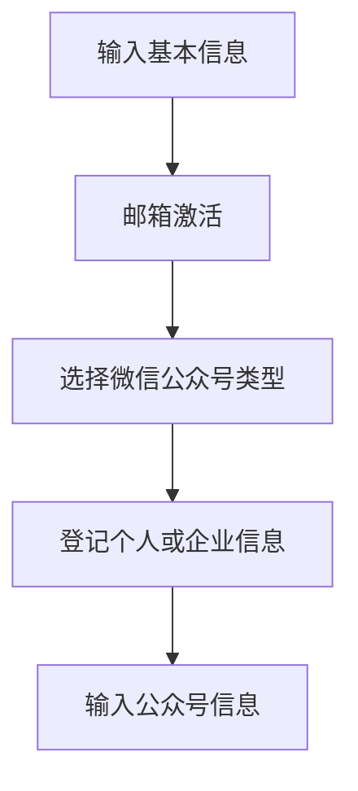

### 微信公众平台账号的分类

1. 订阅号：信息传播，提供订阅消息，在【订阅号】目录中（个人只能申请这个）
2. 服务号：进行服务，提供服务信息
3. 企业号：生产运营管理，帮组组织机构建立连接

### 微信公众号申请流程

```mermaid
graph TB
A[输入基本信息] --> B[邮箱激活]
B --> C[选择微信公众号类型]
C --> D[登记个人或企业信息]
D --> E[输入公众号信息]
```

如果之前已经注册过公众号，但忘记了（：这很常见。。），我们可以先用账号密码登录